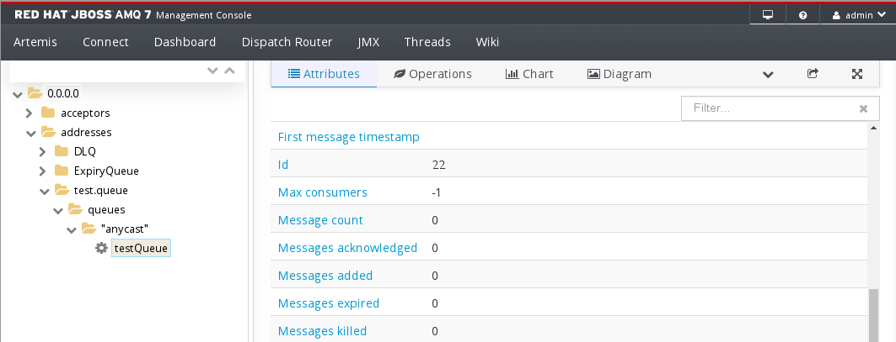

In the previous labs we've configured our broker. Now let's create a Queue to send some messages

Go back to the terminal tab and issue the following command to create an *anycast* queue on the **test** address:

`bin/artemis queue create --auto-create-address --address test.queue --name testQueue --preserve-on-no-consumers --durable --anycast --url tcp://localhost:61616`{{execute}}

You will see an output like the following:

```
Queue [name=testQueue, address=test.queue, routingType=ANYCAST, durable=true, purgeOnNoConsu
mers=false, autoCreateAddress=false] created successfully.
```

#### Browse Queues

If you go back to the console tab, you will see the create address on the left side of the console and under that address, the **testQueue**.

In the left tree navigate to 0.0.0.0 > addresses > test.queue > queues > anycast > testQueue



Now we are ready to send and receive messages on that queue in the next step.
