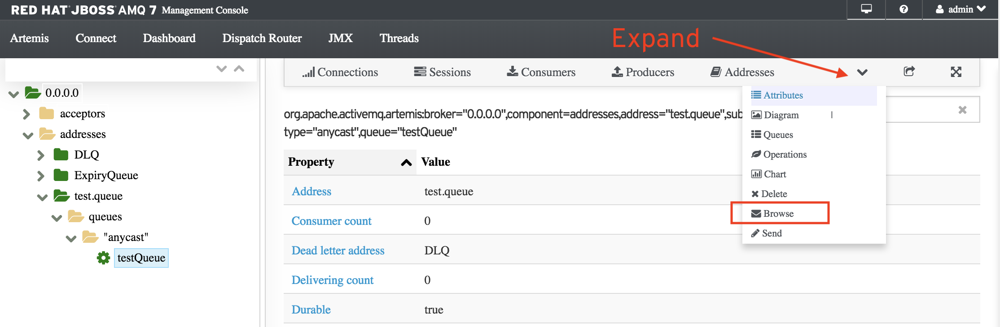

Use the previously create queue to send and receive messages.

To send messages go to the terminal tab and use the included script to send 10 messages to the **testQueue** queue.

`bin/artemis producer --message-count 10 --url "tcp://localhost:61616" --destination test.queue`{{execute}}

You will see an output like the following:

```
Producer ActiveMQQueue[test.queue], thread=0 Started to calculate elapsed time ...           

Producer ActiveMQQueue[test.queue], thread=0 Produced: 10 messages                           
Producer ActiveMQQueue[test.queue], thread=0 Elapsed time in second : 0 s                    
Producer ActiveMQQueue[test.queue], thread=0 Elapsed time in milli second : 17 milli seconds
```

#### Browse messages

To check the messages were successfully send to the broker, check the queue in the broker web console.

In the left tree navigate to 0.0.0.0 > addresses > test.queue > queues > anycast > testQueue



Click on Browse (refresh if necessary)

You will see the 10 messages send by the producer script.